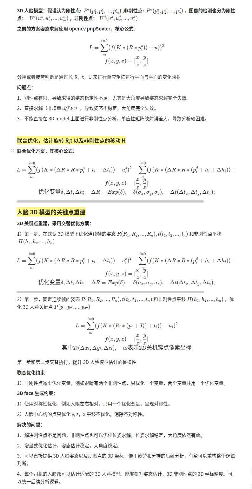

人脸的位姿估计、人脸3D重建、人脸自标定
## Update
- 2025.2.2 跟新，
  - 增加了自标定功能，增加了自标定人脸开车朝前的位姿【fronted_R， fronted_t】
  - 联合优化变量约束，非刚性点减少优化变量
  - 3D face生成约束：1）使用对称性优化；2）人脸中心线的点只优化y, z，x平移不优化，消除不对称性
  - 增加3D模型的可视化
  - 增加在俯仰与侧视人脸的可视化对比

## Prerequisites

- opencv
- ceres[已有]
- Eigen[已有]

## Compile

```shell
# mkdir build
mkdir -p build && cd build
# build
cmake .. && make j8
```
- 由于ceres库需要加入到编译过程中，编译较慢，请耐心等待

## Usage

## Data

- [data](data)
- 输入：fram_id, x1,y1,x2,y2,....,x32,y32[去完畸变的像素坐标]

- 输出：
  - 人脸到相机的3D位姿【R， t】
  - 重构的人脸3D关节点【（x1,y1,z1），(x2,y2,z2)，...,(x32,y32)】
  - 3D face的刚性点坐标和非刚性点坐标【（x1,y1 + h1,z1），(x2,y2 + h2,z2)，...,(x32,y32+ h32,z32)】
  - 自标定人脸开车朝前的位姿【fronted_R， fronted_t】

## 算法原理
